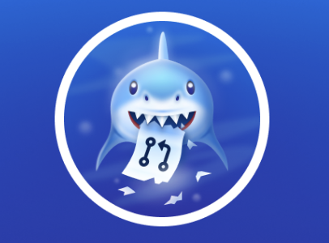

# 🏆 I Earned My First GitHub Badge!

I successfully made my first open-source contribution and earned the **"Pull Shark" (🪙)** achievement!

This repository is my "trophy" to celebrate this milestone.

## My Badge

*(This is what it looks like! You can add a screenshot of your own badge here after you edit this file.)*

---

## How I Did It

I learned how to fork, create a branch, make changes, and open a Pull Request (PR) by following the guide at this amazing project:

**https://github.com/dharmanan/my-first-contribution** 

A huge thank you to that project for helping me get started in open source!
